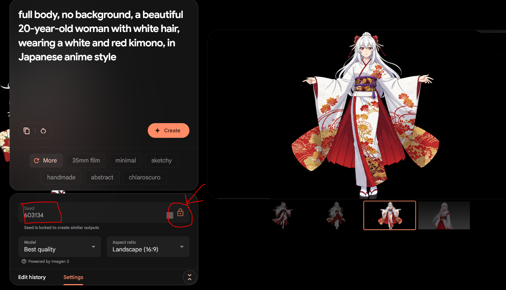
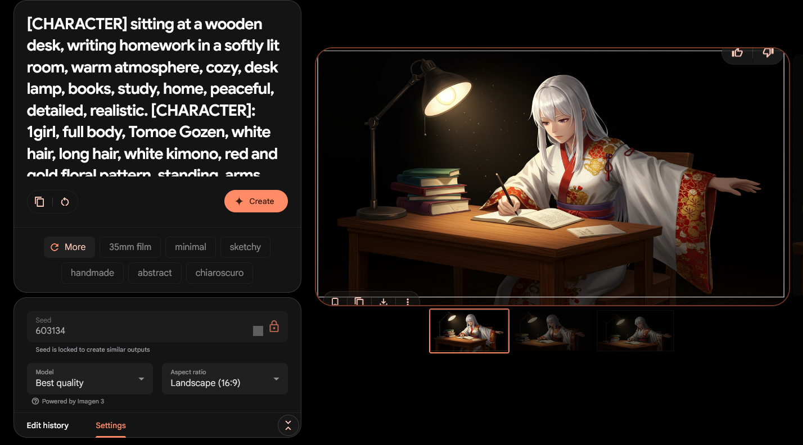

## Imagen 3

Imagen 3 是 Google DeepMind 最新的文生图模型，可以在 [ImageFx](https://labs.google/fx/tools/image-fx) 免费使用。Imagen 3 在 Gemini 内也是可以使用的，Gemini 生成图片有时会不听话，不生成图片，所以本文采用 ImageFx。

## 如何实现人物一致性？

主要有两种方式：

1. 对现有的人物图像进行“引用”，如 Midjourney
2. 对人物描述相当详细的 Prompt，基本适用于各种文生图模型

第一种方式 Imagen 3 不支持，本文就采用第二种。

## 创造人物形象

想要有一个对人物描述相当详细的 Prompt，由人来写就太繁琐了，可以提供一些人物的特征让大语言模型帮我们写，这里采用 Gemini 2.0 Flash Thinking 模型。给出的特征越详细越能生成符合自己想要的人物。

示范 Prompt：

```
你是一名文生图prompt专家，请写一个英文prompt去生成一个人物，将prompt放入代码块中。

prompt要求：

1. 无背景
2. 全身图

人物：

1. 白色头发
2. 穿白里带红的和服
3. 20岁左右的女性
4. 日本动漫风格
```

**注：不要想着生成loli什么的，生成图片时会被判定为“儿童”而无法生成！**

先用大语言模型写的 Prompt 生成一下，如果效果不错，把种子锁定下，最好把种子保存下，方便以后生成尽可能相似的人物。



## 根据人物创造详细的 Prompt

下载一张图片，发给支持图像的大语言模型，并让它根据图像创造出详细的 Prompt。

示范 Prompt：

```
你是一名文生图prompt专家，请写一个英文prompt去描述图像人物，将prompt放入代码块中。
```

## 把人物嵌入图像中

首先先生成一个生成人物坐在桌前写作业的图片的Prompt。

示范 Prompt：

```
你是一名文生图prompt专家，请写一个英文prompt去生成一张图片，将prompt放入代码块中。

要求：

1. 用 [CHARACTER] 代替人物
2. 人物坐在一张桌子前写作业
3. 氛围温馨
```

我们将使用 `[CHARACTER]` 代指人物，然后把上一个步骤生成的 Prompt 拼接进去，如：

```
[CHARACTER] sitting at a wooden desk, writing homework in a softly lit room, warm atmosphere, cozy, desk lamp, books, study, home, peaceful, detailed, realistic.

[CHARACTER]: 1girl, full body, Tomoe Gozen, white hair, long hair, white kimono, red and gold floral pattern, standing, arms outstretched, black background
```



最终效果图：

