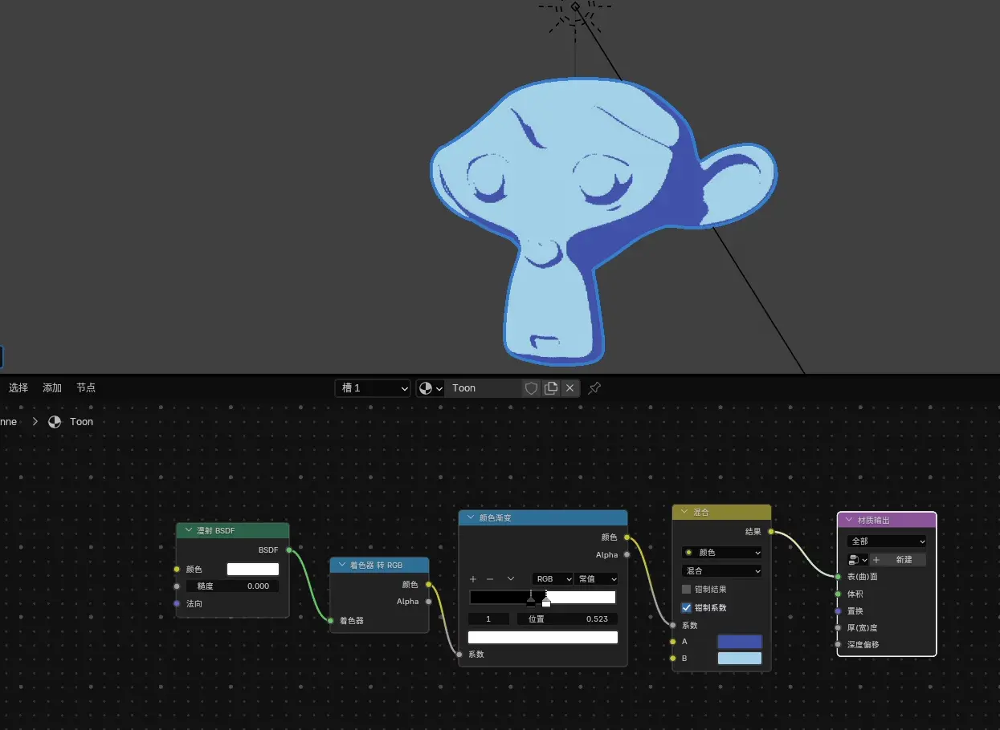
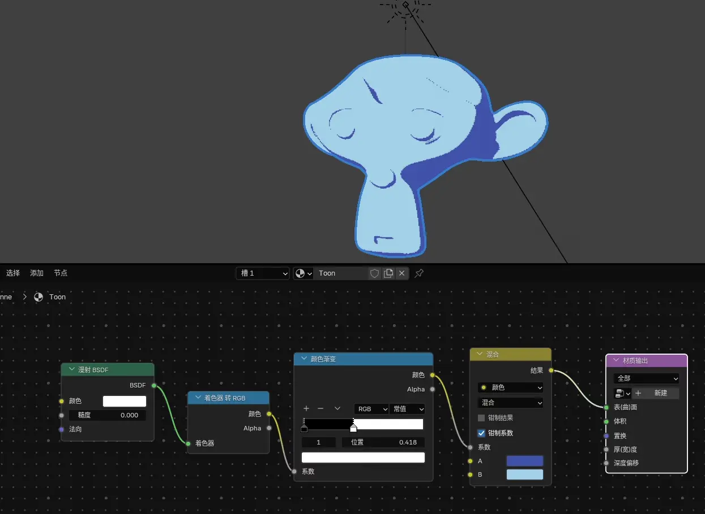
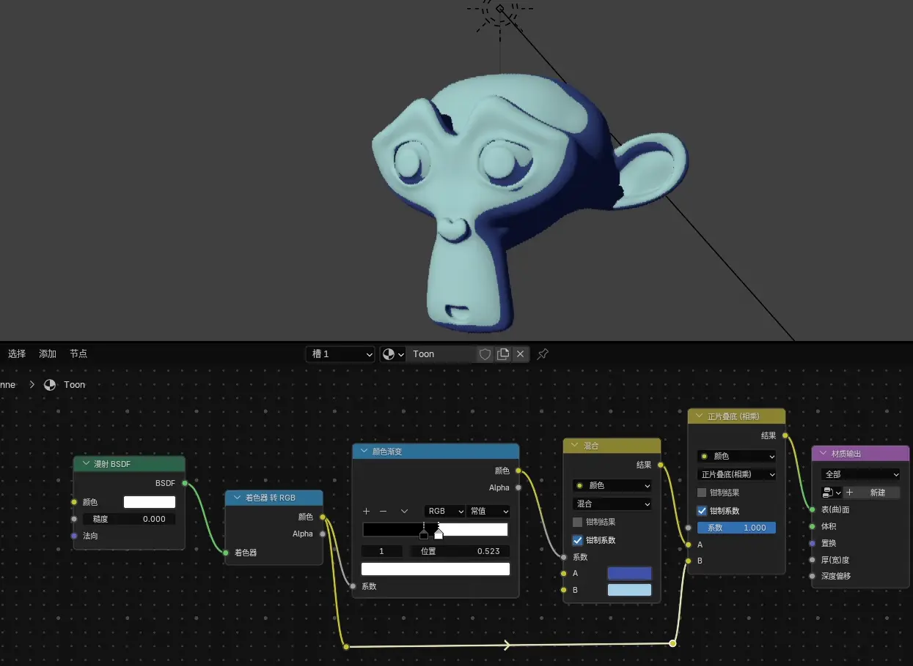
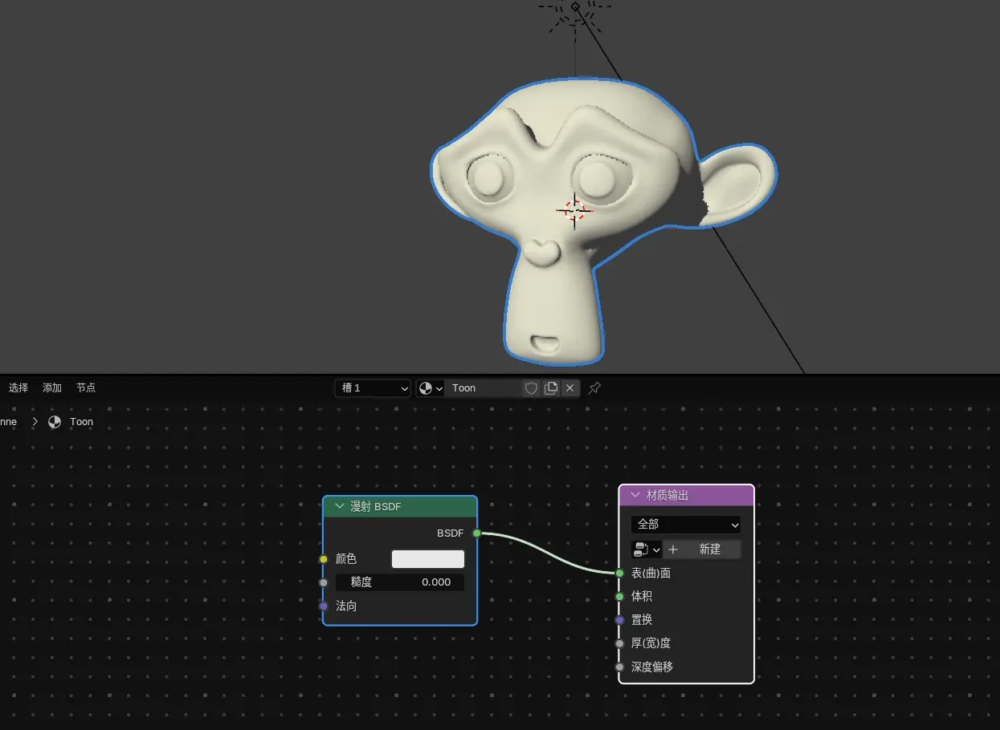

+++
title = '「Blender」最简单的三渲二受光源影响j'
slug = 'blender-toon-shader-light'
date = 2026-08-06T17:20:52+08:00
description = '史上最简单的三渲二手光源影响教程'
keywords = ['Blender', '三渲二', '渲染', '教程']
tags = ['Blender', '三渲二']
categories = ['Blender']
draft = false
image = '受光源影响.webp'
+++

Blender 中，基本的三渲二很简单，加一盏日光，一个「漫射 BSDF」（颜色为纯白色），一个「着色器 转 RGB」，一个「颜色渐变」，就能实现最基础的硬/软阴影的三渲二。

但是是不是看着太单调了呢？对吧，在 PBR 中，物体都是受光的影响的，这样物体表现出的颜色才不会单调。那么在 Blender 中三渲二可以实现吗？

可以的，包可以的兄弟。

## 加一个节点就能实现

最简单的实现受光源影响的方法，只用在我们刚刚的节点上再加一个节点就可以了：

然后改变一下日光的颜色，就可以看到光源的颜色已经反应在了材质上了。

当然添加更多的光源，像点光、面光、聚光，材质也是可以正常受到影响的。

既然可以受到光源影响，接下来怎么让渲染更好看，全靠你的自由发挥啦！

## 那么原理呢？

先来讲讲最基本的三渲二的实现原理。

「漫射 BSDF」是拿来干什么的呢？如果直接把它接到输出上，就会发现它反应了物体受到光照时的 **阴影** 和 **光色**。

「着色器 转 RGB」就不用讲啦，就是让我们可以去操作「漫射 BSDF」的结果的。

「颜色渐变」就相当于把「漫射 BSDF」的输出重新转换到我们在颜色渐变条上设定的颜色，这里设定了黑色和白色，方便用「混合」去给材质上亮部和暗部颜色。因为我们指定了亮部和暗部颜色，所以 **光色** 自然就丢失了，如果没有添加那个「正片叠底」节点，去改变光色的，你会发现物体是不可能有 **光色** 的，只会有阴影分界发生了位移。

既然「漫射 BSDF」可以获得 **光色**，为什么不直接去利用它呢？

如果我们想给一种颜色叠加上一种作为「光」的颜色，那么应该使用 **乘法**，也就是 **正片叠底**。

「漫射 BSDF」的颜色已经被我们设为纯白色，纯白色（没有受到光源影响的部分）就是 1，乘了不会有影响，但是那些有「光色」的部分乘上了颜色，就让那部分的颜色受到了光源的影响了。

所以我们把「着色器 转 RGB」的输出直接作为「正片叠底」的输入，给原本没有受光源影响的颜色，添加上了光色。

## 找不同

看下刚才的图片，你会发现不仅物体表面受到了光源影响，而且暗部居然更暗了，这是为什么呢？

因为「漫射 BSDF」还包含了 **阴影** 了啊，在我们乘上 **光色** 的时候，把原本的阴影给乘上去了，所以就黑了。

怎么解决呢？打点背光，照亮一下吧。

## 其他的

如果你想给你的三渲二人物打点光，但是又不希望把光影响到了其他物体怎么办呢？

Blender 中有「灯光链接」和「阴影链接」。你要把包含了你想要包含或排除的物体的集合指定给灯光的「灯光链接」和「阴影链接」，这俩才能正常工作。

「灯光链接」决定物体是否受到灯光光色的影响，「阴影链接」决定物体是否对灯光的光线进行遮挡。

Blender 原生的操作有两种，首先要在灯光上创建「灯光链接」或「阴影链接」的集合，然后：

1. 从视图大纲中将物体拖入列表中
2. 将一个或多个物体选中，最后选择灯光，然后点旁边的「+」进行添加

物体勾选表示包括，不勾选表示排除。

推荐使用 [Light Helper](https://extensions.blender.org/add-ons/lighthepler/) 插件管理「灯光链接」和「阴影链接」，比 Blender 原生的操作更人性化。

## 写后感悟

看了 B 站和 YouTube 上面很多的三渲二教程，鲜有教程提及这样的方法，明明是很简单的方法，为什么没人去讲呢？太简单了吗？那为什么讲最基础的三渲二的教程又如此之多呢？

2026 年了，大家有问题都在问 AI，有多少人会点进一篇文章去看呢？这篇教程可能最终没几个人能看到，但可能会被 AI 反复爬一遍又一遍，如果能让 AI 学到这种简单的方法，再教会提问的人类，那这篇文章也算是有价值了吧。
