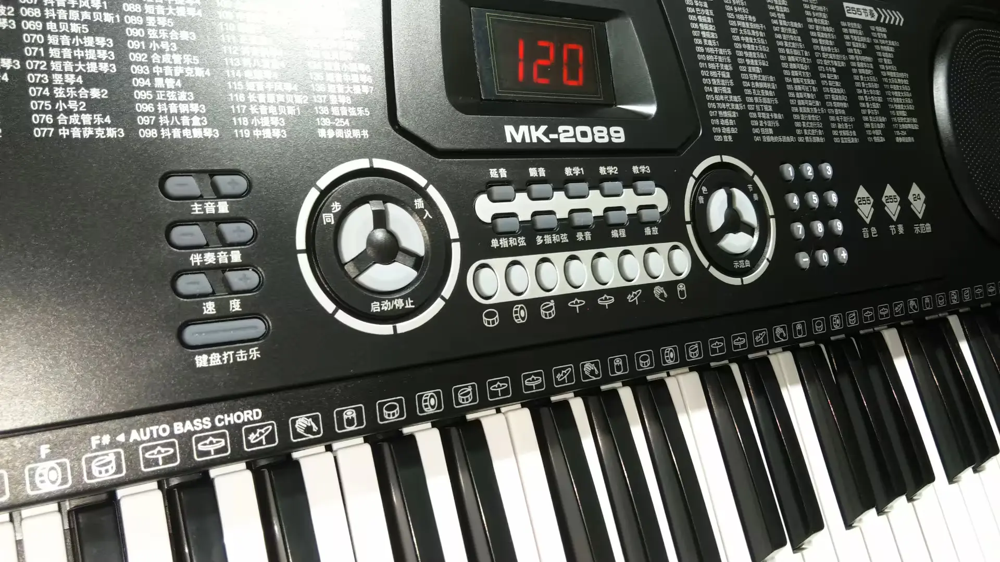
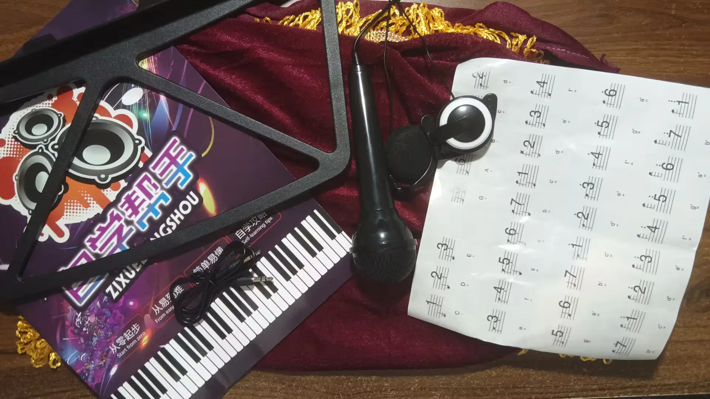

+++
title = '上手美科2089电子琴'
slug = 'new-electronic-keyboard'
date = 2024-08-05T21:23:30+08:00
description = '上手美科2089电子琴'
keywords = ['美科2089', '电子琴', '评测']
tags = ['电子琴', '评测']
categories = ['Life']
+++

最近趁着暑假学钢琴，但家里没有钢琴，于是舅舅送了我一台电子琴。

这台电子琴型号是 MK-2089，61 键，255 种音色，255 种伴奏，24 首示范曲。

## 小故事

### 1

收到的这台电子琴有两个白键翘起来，按照 B 站上的教程，拧了十几个螺丝放回去，又拧了十几个螺丝装好，还有两个拧不回去了，而且手都快拧成麻花了，肯定很香。

### 2

看了电子琴架拼装示范图半天，都不知道怎么装电子琴架，毕竟我连劳动课上简单的小东西看说明书也做不出来。最后我对着孔的间距装好了，然后我发现电子琴可以直接放桌子上，把椅子升高一下就能弹了...

## 图片

## 评测

这些仅是我个人的看法，我不是专业的。

优点：

* 耳机看上去很高级，因为没有其他耳机，无法比较
* 修起来方便
* 有麦克风，改天我可以去做主播了（试了一下，插在电脑上没什么用）

缺点：

* 音色听上去一般般
* 没有 MIDI 接口
* 没有触感检测，也就是弹出来的音没有轻重
* 示范曲听起来明显是一个人写的
